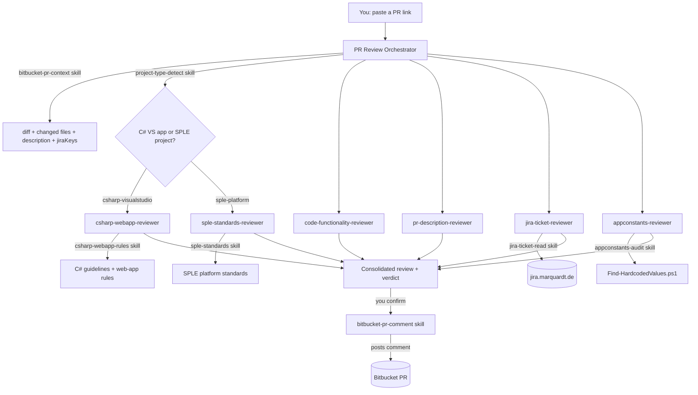

# Marquardt Pull Request Review Agents

An AI review system for the Marquardt projects on Bitbucket Server
([git.marquardt.de](https://git.marquardt.de)). One **orchestrator** agent runs a team of specialized
**reviewer sub-agents** against a pull request and produces a single consolidated review.

It handles two project families and automatically applies the matching coding ruleset:
- **TDST** — C# / ASP.NET (Visual Studio) web apps (e.g. `mq_feedback`) → **C# Coding Guidelines & Best
  Practices v1.0** + security/reliability baseline.
- **SPLE** — spl-core embedded software product lines (VS Code-based: CMake + KConfig + variants, C/C++/Python)
  → **SPLE platform standards**.

This repo is the central hub: build and refine the agents here, then copy `.github/agents` and
`.github/skills` into any Marquardt repository (or your VS Code user profile) to use them there.

## Architecture



### Agents (`.github/agents/`)
| Agent | Role |
|-------|------|
| `pr-review-orchestrator` | Entry point. Gathers PR context, detects project type, delegates, aggregates, decides the verdict. |
| `code-functionality-reviewer` | Is the code correct? Logic, edge cases, null handling, regressions. |
| `pr-description-reviewer` | Does the code match what the PR description claims (both directions)? |
| `jira-ticket-reviewer` | Does the change satisfy the linked Jira ticket + Definition of Done? |
| `appconstants-reviewer` | Are paths/URLs/config in a constants class, not scattered? Secrets = blocker. |
| `csharp-webapp-reviewer` | **C#** projects: C# Coding Guidelines v1.0 (naming/style/architecture) + security, errors, resources, async. |
| `sple-standards-reviewer` | **SPLE** projects: component/variant structure, KConfig, CMake, embedded C/C++, tests & quality gates, static analysis. |

### Skills (`.github/skills/`)
| Skill | Used by | What it does |
|-------|---------|--------------|
| `bitbucket-pr-context` | orchestrator | Get the diff + changed files + PR metadata (Bitbucket REST, or local git). |
| `bitbucket-pr-comment` | orchestrator | Post the review back to the PR (summary + inline comments). |
| `project-type-detect` | orchestrator | Classify the repo as C# Visual Studio vs SPLE/spl-core and pick the ruleset. |
| `jira-ticket-read` | jira-ticket-reviewer | Read a Jira issue via REST v2 (mirrors the mq_feedback app). |
| `appconstants-audit` | appconstants-reviewer | Scan for hardcoded paths/URLs/secrets; rules reference. |
| `csharp-webapp-rules` | csharp-webapp-reviewer | C# Coding Guidelines & Best Practices v1.0 + web-app security/reliability rules. |
| `sple-standards` | sple-standards-reviewer | SPLE / spl-core platform standards (CMake, KConfig, C/C++, tests, SCA). |

#### General-purpose skills (available while programming)
These are not part of the PR-review flow — they are general Copilot skills bundled in the package and
installed alongside the review skills, so they're available in every workspace after `install-to-vscode.bat`.
| Skill | What it does |
|-------|--------------|
| `pptx` | Create, read, edit and combine PowerPoint (`.pptx`) presentations. |
| `docx` | Create, read and edit Word (`.docx`) documents. |
| `pdf` | Read, extract, fill forms and manipulate PDF files. |
| `xlsx` | Create, read and edit Excel (`.xlsx`) spreadsheets. |
| `skill-creator` | Create, improve and evaluate Copilot skills. |
| `frontend-design` | Guidance for distinctive, intentional UI/visual design. |
| `token-saver` | Low-token mode: terse answer-first replies, no big output dumps, efficient tool use. |

## How a PR Review Works
A pull request comes **from a branch** and is tied to **a Jira ticket** (created by the `mq_feedback` feedback
app). VS Code has no native Bitbucket Server integration, so the orchestrator fetches the
context itself. The easiest way is to **paste the PR link**:

1. **Paste a PR URL** like
   `https://git.marquardt.de/projects/TDST/repos/<repo>/pull-requests/42/overview`. With a `BITBUCKET_PAT`
   set, the script reads the **metadata, changed files and the unified diff directly from the Bitbucket REST
   API** — no local checkout needed. It also pulls the linked **Jira** keys and reads them from
   `jira.marquardt.de/rest/api/2/issue/{key}` (the same mechanism the `mq_feedback` app uses).
2. **No token / offline?** It falls back to **local git**, diffing the source branch against the target via
   the merge-base (what Bitbucket shows). This needs the repo checked out but no credentials.

The orchestrator then **detects the project type** (via the `project-type-detect` skill) and applies the
matching coding ruleset:
- **C# Visual Studio** repos (`.sln`/`.csproj`/`.aspx` — e.g. TDST `mq_feedback`) → the
  **`csharp-webapp-reviewer`** (C# Coding Guidelines v1.0 + security/reliability).
- **SPLE / spl-core** repos (CMake + `KConfig` + `variants/`, C/C++/Python, VS Code-based — project key
  `SPLE`) → the **`sple-standards-reviewer`** (SPLE platform standards).

It then fans out to the reviewers, merges their findings, returns one report with a verdict (**APPROVE**,
**APPROVE WITH COMMENTS**, **CHANGES REQUESTED**), and — if you confirm — posts it back to the PR as a comment.

---

# Step-by-Step Guide

## Prerequisites
- **VS Code** with GitHub Copilot (agent mode) — you already have this.
- **PowerShell 7+** (`pwsh`). Check: `pwsh -version`. The skill scripts are PowerShell.
- **Git** on your PATH (only needed for the local-git fallback / branch mode).
- Network access to `git.marquardt.de` and `jira.marquardt.de`.

## One-Time Setup

### Step 1 — Make the agents available in your project
The agents and skills must live in the repo you review (or your user profile). Pick one:

- **Per repo (team-shared, recommended):** copy the `.github/agents` and `.github/skills` folders from this
  repo into the target TDST repository.
  ```powershell
  # from the target repo root; set $AiAgents to your local clone of this repo
  $AiAgents = "<path-to-your-clone>/ai-agents"
  Copy-Item -Recurse "$AiAgents/.github/agents" .\.github\ -Force
  Copy-Item -Recurse "$AiAgents/.github/skills" .\.github\ -Force
  ```
- **Personal (all your workspaces):** run **`install-to-vscode.bat`** from this repo (double-click it, or
  run it in a terminal). It auto-detects your VS Code user `prompts` folder — Scoop, stable, or Insiders —
  then copies the agent files into it and the skills into `prompts\skills\`. To target a specific folder,
  pass it as an argument: `install-to-vscode.bat "D:\path\to\User\prompts"`. If no VS Code folder is found on
  the PC, it asks you to type one.

  > **Note — skills need one extra setting to go global (the installer sets it for you).**
  > Agent files (`*.agent.md`) placed in the user `prompts` folder are picked up in every workspace
  > automatically. **Skills are not** — VS Code only scans workspace locations (`.github/skills/`,
  > `.agents/skills/`, `.claude/skills/`) unless an extra location is registered in your **user**
  > `settings.json` via `chat.agentSkillsLocations`. `install-to-vscode.bat` runs `Add-SkillsLocation.ps1`
  > to add this entry for you (idempotently, preserving your existing settings):
  > ```jsonc
  > "chat.agentSkillsLocations": {
  >     "~/.../User/prompts/skills": true
  > }
  > ```
  > The value **must be relative or start with `~/`** (VS Code rejects absolute paths and `\`
  > separators). `~/` resolves to your home folder, so the entry applies to **all** workspaces. If you
  > ever add it by hand, point the path at wherever the installer put `prompts/skills` (forward slashes).

Reload VS Code (`Developer: Reload Window`) so the new agent shows in the agent picker and the skills load
in every workspace.

### Step 2 — Create your access tokens
You need two Personal Access Tokens (PATs). Treat them like passwords.

| Token | Where to create it | Scope needed |
|-------|--------------------|--------------|
| **Bitbucket** | git.marquardt.de → your avatar → *Manage account* → *Personal access tokens* → *Create* | **Repository: Write** (Write is required to **post** comments; Read alone only fetches the diff) |
| **Jira** | jira.marquardt.de → your avatar → *Profile* → *Personal Access Tokens* → *Create token* | Read (default) |

### Step 3 — Set the tokens as environment variables
Per session (quickest):
```powershell
$env:BITBUCKET_PAT = '<your-bitbucket-token>'
$env:JIRA_PAT      = '<your-jira-token>'
```
Persist for your user (so you don't repeat it — do **not** put real tokens in any committed file):
```powershell
setx BITBUCKET_PAT "<your-bitbucket-token>"
setx JIRA_PAT      "<your-jira-token>"
# reopen the terminal/VS Code afterwards
```

---

## Review a Pull Request (main flow)

### Step 1 — Open the project & the agent
Open the target TDST repo in VS Code. In Copilot Chat, open the agent picker and choose
**PR Review Orchestrator**.

### Step 2 — Give it the PR link
Paste the pull-request URL and ask for a review, e.g.:
```
Review https://git.marquardt.de/projects/TDST/repos/feedback-tooling/pull-requests/42/overview
```

### Step 3 — Let it gather context and run the reviewers
The orchestrator will:
1. Run `bitbucket-pr-context` to fetch the diff, changed files, description, and linked Jira keys.
2. Delegate to the five reviewers (functionality, PR-description match, Jira alignment, AppConstants, C# rules).
3. Aggregate everything into one report with a verdict. This appears in chat.

### Step 4 — Read the consolidated report
You get a single report like:
```
# PR Review — Fix attachment cleanup (feature/TDST-123 → develop)
Jira: TDST-123 | Files changed: 6 | Verdict: CHANGES REQUESTED
## Summary …
## Findings by Area … (Functionality / PR Description / Jira / AppConstants / C# Rules)
## Blockers …
## Nice-to-have …
```

### Step 5 — Post the review to the PR (optional)
The orchestrator asks: *“Post this review to the Bitbucket PR as a comment?”*
- It first shows a **dry-run preview** (exactly what will be posted — nothing sent yet).
- Reply **yes** to post. It returns a clickable link to the created comment.
- Want line-level notes too? Ask it to *“post the findings as inline comments”* and it anchors each to its
  `file:line`.

> Posting requires the **write-scoped** `BITBUCKET_PAT`. If you see `401/403`, your token is read-only —
> recreate it with *Repository: Write*.

---

## Other Ways to Run

### Without a token (local git)
If you don't have a token, check out the branch and review locally:
```
Review branch feature/TDST-123 against develop
```
Run `git fetch origin` first so the branch is available. (Posting comments is not available in this mode.)

### Run a single reviewer
You can pick any reviewer agent directly while iterating, e.g. choose **appconstants-reviewer** and say
*“audit `FeedbackAsp` for hardcoded paths.”*

### Run a skill script by hand
Every skill is just a documented PowerShell script you can run yourself:
```powershell
# context (diff + metadata + jira keys)
pwsh .\.github\skills\bitbucket-pr-context\scripts\Get-PullRequestContext.ps1 -Url <pr-url>

# read a Jira ticket
pwsh .\.github\skills\jira-ticket-read\scripts\Get-JiraTicket.ps1 -TicketKey TDST-123

# scan for hardcoded values
pwsh .\.github\skills\appconstants-audit\scripts\Find-HardcodedValues.ps1 -Path .\FeedbackAsp

# preview a PR comment (posts nothing)
pwsh .\.github\skills\bitbucket-pr-comment\scripts\Add-PullRequestComment.ps1 -Url <pr-url> -File review.md -DryRun
```

---

## Configuration Reference (no secrets in source)

| Variable | Purpose | How to create |
|----------|---------|---------------|
| `BITBUCKET_PAT` | Fetch PR diff/metadata **and post comments** | git.marquardt.de → Profile → *Personal access tokens* (Repository: **Write**) |
| `JIRA_PAT` | Read Jira tickets | jira.marquardt.de → Profile → *Personal Access Tokens* |

The scripts also accept `-User/-Password` (Basic auth, parity with mq_feedback) and `-UseDefaultCredentials`
(domain SSO) instead of a token. Never commit tokens.

## Troubleshooting

| Symptom | Cause / Fix |
|---------|-------------|
| Agent not in the picker | Files not in `.github/` of the open repo (or user profile). Reload window. |
| `Could not parse a Bitbucket PR URL` | URL must contain `.../projects/<KEY>/repos/<slug>/pull-requests/<id>`. |
| `401`/`403` on read | `BITBUCKET_PAT` missing/expired, or no access to that repo. |
| `401`/`403` when posting | Token is read-only — recreate with *Repository: Write*. |
| Diff is empty | Wrong target branch. Pass the right one or use `-TargetBranch`. |
| Jira reviewer says “no ticket” | No `TDST-####` key in the branch/title/description — add the link. |
| REST blocked / offline | Use branch mode (local git): `Review branch <src> against <target>`. |
| Wrong ruleset applied | Project misclassified — check `project-type-detect`; pass the right project key, or invoke the `csharp-webapp-reviewer` / `sple-standards-reviewer` directly. |
| `pwsh` not found | Install PowerShell 7+ and reopen the terminal. |

## Defaults & Conventions
- **Bitbucket:** `https://git.marquardt.de`, REST API v1.0. Project keys: `TDST` (C# web apps), `SPLE` (spl-core).
- **Jira:** `https://jira.marquardt.de`, REST API v2, issue key pattern `[A-Z][A-Z0-9]+-\d+`.
- **Constants (C#):** `AppConstants.cs` / `Header.cs` / `Constants.cs`, `UPPER_SNAKE_CASE` static fields.
- **C# rules:** C# Coding Guidelines & Best Practices v1.0 (`CS-*`) plus a security/reliability baseline
  (`SEC-*`/`ERR-*`/`RES-*`/`ASY-*`) — see
  `.github/skills/csharp-webapp-rules/references/csharp-coding-guidelines.md` and `csharp-webapp-rules.md`.
- **SPLE rules:** platform standards (`SPL-*`) for spl-core projects (CMake, KConfig/variants, embedded C/C++,
  GoogleTest/pytest + quality gates, cppcheck) — see `.github/skills/sple-standards/references/sple-standards.md`.
  Project-type routing lives in `.github/skills/project-type-detect/scripts/Get-ProjectType.ps1`.

## Customize
- Tighten or extend the C# rules in the `csharp-webapp-rules` references (`csharp-coding-guidelines.md` for
  naming/style/architecture, `csharp-webapp-rules.md` for security/reliability).
- Tune the SPLE standards in `sple-standards/references/sple-standards.md` (defer to a repo's own `AGENTS.md`
  and `sple-sca-ruleset` where they are more specific).
- Adjust the project-type markers/scores in `project-type-detect/scripts/Get-ProjectType.ps1` if a repo is
  misclassified.
- Adjust scanned patterns/exclusions in `appconstants-audit/scripts/Find-HardcodedValues.ps1`.
- Change the default target branch (`develop`) in `Get-PullRequestContext.ps1` if your team uses another.
- Change the default project key (`TDST`) in the script params if you reuse this for another project.
