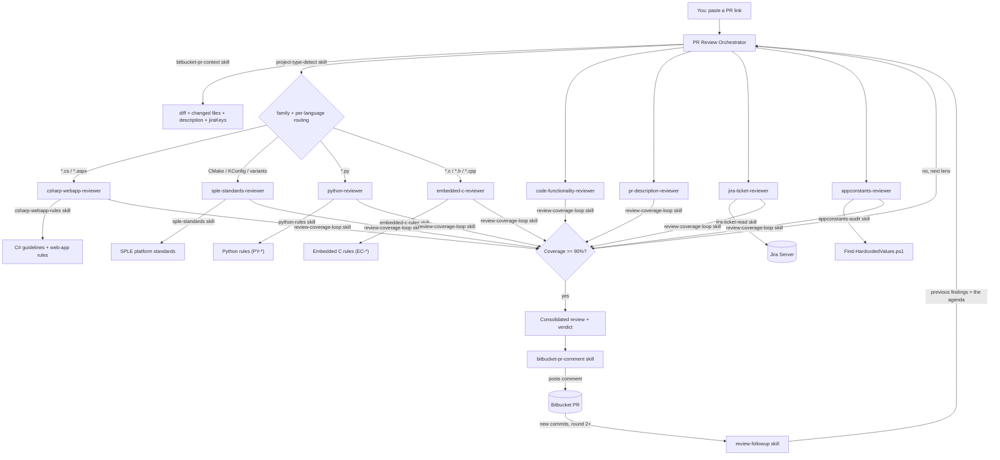

# AI Autopilot — Pull Request Review Agents & Skills

An AI review system for pull requests on **Bitbucket Server / Data Center**. One **orchestrator** agent runs a
team of specialized **reviewer sub-agents** against a pull request, keeps re-scanning until an estimated **90%
of the findings are found**, and produces a single consolidated review. When you push fixes and ask again, it
**re-reviews the original findings** instead of inventing a new list every round.

It recognises **four project families** and applies **every** rule set the change actually needs — because one
pull request routinely touches more than one language:

| Family | Structural rules | Detected by |
|--------|-----------------|-------------|
| **C# / ASP.NET (Visual Studio) web apps** | C# Coding Guidelines & Best Practices v1.0 + security/reliability baseline | `.sln`, `.csproj`, `.aspx`, `Web.config` |
| **SPLE** — spl-core embedded product lines | SPLE platform standards (structure, CMake, KConfig, variants) | `CMakeLists.txt` + `KConfig` + `variants/` |
| **Python** — standalone services, scripts, tooling | Python rules (`PY-*`) | `pyproject.toml`, `setup.py`, `manage.py` |
| **Embedded C** — firmware without spl-core | Embedded C rules (`EC-*`) | `.ld`/`.icf` linker scripts, `.ioc`, PlatformIO, FreeRTOS |

**Structural and language rules compose.** An SPLE change touching `.c` and `.py` gets **sple-standards** for the
build wiring *plus* **embedded-c-rules** and **python-rules** for the code itself. Picking a single winner is how
the Python half of a diff ships unreviewed — see [Multi-language routing](#multi-language-routing).

This repo is the central hub: build and refine the agents here, then copy `.github/agents` and
`.github/skills` into any repository (or your VS Code user profile) to use them there.

## Architecture



### Agents (`.github/agents/`)
| Agent | Role |
|-------|------|
| `pr-review-orchestrator` | Entry point. Gathers PR context, detects project type and review round, delegates, enforces the 90% coverage gate, owns the finding IDs, aggregates, decides the verdict. |
| `code-functionality-reviewer` | Is the code correct? Logic, edge cases, null handling, regressions. |
| `pr-description-reviewer` | Does the code match what the PR description claims (both directions)? |
| `jira-ticket-reviewer` | Does the change satisfy the linked Jira ticket + Definition of Done? |
| `appconstants-reviewer` | Are paths/URLs/config in a constants class, not scattered? Secrets = blocker. |
| `csharp-webapp-reviewer` | **C#** projects: C# Coding Guidelines v1.0 (naming/style/architecture) + security, errors, resources, async. |
| `sple-standards-reviewer` | **SPLE** projects: component/variant structure, KConfig, CMake, tests & quality gates, static analysis. |
| `python-reviewer` | **Python** files: correctness traps, resources, typing, security, perf, pytest, packaging (`PY-*`). |
| `embedded-c-reviewer` | **C/C++** files: memory safety, ISRs & `volatile`, allocation/stack, integers, control flow (`EC-*`). |

### Skills (`.github/skills/`)
| Skill | Used by | What it does |
|-------|---------|--------------|
| `bitbucket-pr-context` | orchestrator | Get the diff + changed files + PR metadata (Bitbucket REST, or local git). |
| `bitbucket-pr-comment` | orchestrator | Post the review back to the PR (summary + inline comments). |
| `project-type-detect` | orchestrator | Classify the repo family **and** route each changed file to the rule sets that govern it. |
| `review-coverage-loop` | **every reviewer** | Re-scan with a new lens each pass until estimated finding coverage reaches 90%. |
| `review-followup` | **every reviewer** | Round 2+: verify the original findings by ID; block new off-topic findings. |
| `jira-ticket-read` | jira-ticket-reviewer | Read a Jira issue via REST v2. |
| `appconstants-audit` | appconstants-reviewer | Scan for hardcoded paths/URLs/secrets; rules reference. |
| `csharp-webapp-rules` | csharp-webapp-reviewer | C# Coding Guidelines & Best Practices v1.0 + web-app security/reliability rules. |
| `sple-standards` | sple-standards-reviewer | SPLE / spl-core platform standards (CMake, KConfig, variants, tests, SCA). |
| `python-rules` | python-reviewer | Python rule set `PY-*` — correctness, errors, resources, typing, security, perf, tests, packaging. |
| `embedded-c-rules` | embedded-c-reviewer | Embedded C/C++ rule set `EC-*` — memory, types, allocation, ISRs, hardware, integers, flow, errors. |

#### General-purpose skills (available while programming)
These are not part of the PR-review flow — they are general skills bundled in the package and installed
alongside the review skills, so they're available in every workspace after running the installer
(`install.bat` on Windows, `./install.sh` on macOS/Linux). They are **vendored from
[anthropics/skills](https://github.com/anthropics/skills) and refreshed automatically on every install** —
see [Staying in sync with upstream](#staying-in-sync-with-upstream).
| Skill | What it does |
|-------|--------------|
| `pptx` | Create, read, edit and combine PowerPoint (`.pptx`) presentations. |
| `docx` | Create, read and edit Word (`.docx`) documents. |
| `pdf` | Read, extract, fill forms and manipulate PDF files. |
| `xlsx` | Create, read and edit Excel (`.xlsx`) spreadsheets. |
| `skill-creator` | Create, improve and evaluate Copilot skills. |
| `frontend-design` | Guidance for distinctive, intentional UI/visual design. |
| `token-saver` | Low-token mode: terse answer-first replies, no big output dumps, efficient tool use. |

#### Staying in sync with upstream
The Anthropic-authored skills above are **vendored** in `.github/skills`, and every install refreshes them
from [anthropics/skills](https://github.com/anthropics/skills) first, so you never install a stale copy.

Which ones get refreshed is **auto-detected**: any folder in `.github/skills` whose name also exists upstream
under `skills/`. Nothing to maintain — a skill added on either side is picked up on the next run, and our own
skills (`bitbucket-*`, `review-*`, `appconstants-audit`, `sple-standards`, …) have no upstream counterpart and
are never touched.

```bash
./update-anthropic-skills.sh              # refresh to latest main (installers call this for you)
./update-anthropic-skills.sh --list       # what's vendored vs. what upstream offers
./update-anthropic-skills.sh --dry-run    # show what would change
./update-anthropic-skills.sh --ref v1.2   # pin to a tag / branch / commit
```
```powershell
.\Update-AnthropicSkills.ps1              # same, on Windows (-List / -DryRun / -Ref / -Force)
```

- The resolved upstream commit is recorded in `.github/skills/.anthropic-skills.lock.json`, so you can see
  exactly which version is vendored and a re-run is a no-op when nothing changed.
- Vendored folders are **replaced wholesale** (so files deleted upstream disappear here too) — don't
  hand-edit them, upstream wins. Everything is under git: `git diff -- .github/skills` before committing.
- **Offline is fine.** Every network failure warns and keeps the vendored copies; the install continues.
- Skip it with `--no-anthropic` (shell) / `-NoAnthropicUpdate` (PowerShell).
- To start tracking another upstream skill (`mcp-builder`, `canvas-design`, `claude-api`, …), just create the
  folder in `.github/skills` with that name — the next run fills it. `--list` shows what's available.

## Multi-language Routing

A pull request is rarely one language. An SPLE change adds a C driver *and* touches the Python build script;
a C# app ships alongside a Python deploy job. The older design picked one ruleset per repo, which meant
whatever wasn't picked went unreviewed — silently, with the review still reporting success.

So `project-type-detect` answers **two separate questions**:

| Field it returns | Meaning | What the orchestrator does |
|------------------|---------|----------------------------|
| `projectType` | Repo family: `csharp-visualstudio`, `sple-platform`, `python`, `embedded-c`, `mixed`, `other` | Context, and picks the structural ruleset |
| `structuralRuleset` | Repo-wide conventions reviewer, or null | Runs it whenever present |
| `routing` | One entry per language **in the changed files**: `{ruleset, reviewer, fileCount, files}` | Runs **every** entry, handing each reviewer only its own files |

Both lists run. Structural rules cover the repo's conventions; language rules cover the code:

```
SPLE PR touching components/app/src/main.c, tools/build.py, variants/ecu/config.txt
  → sple-standards-reviewer   (structure, CMake, KConfig, variants)
  → embedded-c-reviewer       (main.c)
  → python-reviewer           (build.py)
```

Precedence: spl-core markers deliberately outrank the generic Python and embedded-C ones they subsume. An SPLE
repo has `pyproject.toml` and `.c` files too — classifying it as "python" would drop the variant and KConfig
rules only `sple-standards` knows about. The language reviewers still run on those files; they just don't
decide the family.

Each finding is reported **once**, under whichever rule set actually describes the defect — `sple-standards`
for build and variant wiring, `embedded-c-rules` or `python-rules` for the code. The orchestrator drops the
duplicate rather than reporting the same line twice.

If the diff is docs, config or build-only, `routing` comes back empty and the report says so instead of
inventing a language reviewer to run.

Routing is computed from the **changed files**, so pass `-ChangedFilesFile` when reviewing a PR. With only
`-RepoPath` it describes the whole repository — right for "what is this project", too broad for "what should
this PR be reviewed against".

## The 90% Coverage Loop

A single review pass finds the obvious problems and misses the rest. Every reviewer therefore loads the
**`review-coverage-loop`** skill and keeps going until it can show it is ~90% done:

1. **Pass 1** — scan, record findings.
2. **Pass n** — scan again with a **different lens** (callers instead of diff order, the rule list instead of
   the code, failure modes instead of syntax, whole files instead of hunks). Only genuinely new findings count.
3. **Estimate coverage** after each pass:
   - marginal rate: `C = 1 - new_n / total`, and
   - capture-recapture cross-check between two passes: `N_est = |A|·|B| / |A∩B|`, `C = |A∪B| / N_est`.
   - When both are available, the **lower** one wins.
4. **Stop at `C ≥ 90%`** (minimum 2 passes). **Hard cap: 5 passes** — if it still hasn't converged, the review
   says so instead of pretending to be complete.

**Scope: the diff, and only the diff.** Every finding must anchor to a line the change actually touched — an
added/modified line, or one whose behaviour a removal altered. Reviewers read as much untouched code as they
need for context, but it is never the *location* of a finding. When a changed line breaks untouched code, the
finding anchors to the changed line and names the other spot as `impact:`. Anything else they notice goes
under **Deferred (not blocking this PR)**: one line, no severity, no effect on the verdict, not counted in
coverage. The orchestrator holds the diff, so it builds the changed-line set and re-anchors or defers any
finding that falls outside it — a review that grades the whole file is unactionable and makes a small PR
unmergeable.

The orchestrator enforces this across the whole review: any reviewer that reports below 90% gets re-dispatched
with its existing findings attached (so the next pass is independent, not a repeat). **Overall coverage is the
lowest area's coverage, not the average** — one weak area means the review is that weak. The number appears in
the report header and per area:

```
Coverage: 92% (3 passes, last pass added 1 of 24)
```

A missing figure is treated as **unmeasured**, never as 100%.

## Follow-up Reviews (round 2+)

The failure mode of an AI reviewer is topic drift: you fix its five findings, ask again, and get five
*different* findings back. The PR never converges. The **`review-followup`** skill prevents that.

Every finding gets a **stable ID** on the first review — `F1`, `F2`, `F3` — that is never renumbered and never
reused. When the PR gets new commits and you ask for another review, the orchestrator detects round 2+, reads
the previous findings back off the posted PR comment, and treats that list as **the agenda**:

```
Round 2 — follow-up review of 5 previous findings (head 9f3ac21, previously a1b2c3d)

## Previous findings
[F1] FIXED — null check added at src/Foo.cs:44
[F3] NOT FIXED — src/Foo.cs:88 still concatenates the SQL string
[F4] PARTIAL — fixed in OrderService, same pattern remains in InvoiceService:120
[F5] REGRESSED — the using block now disposes the stream before the caller reads it (src/Bar.cs:31)
[F2] WITHDRAWN — the framework already encodes this; round 1 was wrong

## New findings (new commits only)
[F8][Major] src/Bar.cs:57 — … Fix: …

Resolved: 2 of 5   |   Coverage: 94% (delta since a1b2c3d, 2 passes)
```

Rules that make it converge:
- **Original findings first.** Each gets exactly one verdict: `FIXED` / `PARTIAL` / `NOT FIXED` / `REGRESSED` /
  `WITHDRAWN`. `FIXED` needs evidence — the line that now does the right thing, not the author's word.
- **New findings are filtered.** A new finding is only reportable if it is in code the **new commits touched**,
  is a **regression** caused by one of the fixes, or is a **Blocker**. Everything else — including real issues
  the first round walked past — goes under **Deferred (not blocking this PR)**: visible, but not part of the
  verdict. Round 1 saw that code and passed it; raising it now is moving the goalposts.
- **Coverage doesn't restart.** The loop runs on the incremental diff only and reports
  `Coverage: <n>% (delta since <sha>)`. A two-line fix commit gets one or two passes, not five.
- **A clean follow-up is short.** All originals fixed and nothing new → a few lines and APPROVE.

The finding IDs and the reviewed head commit are written into the posted PR comment — that is how the next
round finds its agenda. If the previous review can't be recovered, the orchestrator says so and runs a full
first review rather than improvising a new list.

## How a PR Review Works
A pull request comes **from a branch** and is usually tied to **a Jira ticket**. VS Code has no native
Bitbucket Server integration, so the orchestrator fetches the context itself. The easiest way is to **paste the
PR link**:

1. **Paste a PR URL** like
   `https://bitbucket.example.com/projects/PROJ/repos/<repo>/pull-requests/42/overview`. With a `BITBUCKET_PAT`
   set, the script reads the **metadata, changed files and the unified diff directly from the Bitbucket REST
   API** — no local checkout needed. It also pulls the linked **Jira** keys and reads them from
   `<jira-base-url>/rest/api/2/issue/{key}`.
2. **No token / offline?** It falls back to **local git**, diffing the source branch against the target via
   the merge-base (what Bitbucket shows). This needs the repo checked out but no credentials.

The orchestrator then runs the `project-type-detect` skill, which returns the repo family **and** a routing
list of every rule set the changed files need:
- **C# Visual Studio** repos (`.sln`/`.csproj`/`.aspx`) → **`csharp-webapp-reviewer`**.
- **SPLE / spl-core** repos (CMake + `KConfig` + `variants/`) → **`sple-standards-reviewer`**.
- Any changed **`.py`** files → **`python-reviewer`**; any changed **`.c`/`.h`/`.cpp`** → **`embedded-c-reviewer`**,
  whether or not that is the repo's main language.

All of them run — see [Multi-language routing](#multi-language-routing).

It then fans out to the reviewers, runs the coverage loop until each area reaches 90%, merges their findings,
returns one report with a verdict (**APPROVE**, **APPROVE WITH COMMENTS**, **CHANGES REQUESTED**), and posts it
back to the PR as a comment.

---

# Step-by-Step Guide

## Prerequisites
- **VS Code** with GitHub Copilot (agent mode), or **Claude Code**.
- **Git** on your PATH (only needed for the local-git fallback / branch mode).
- Network access to your Bitbucket Server and Jira instances.
- **PowerShell 7+** (`pwsh`) — check with `pwsh -version`. The *skill scripts* (PR context, Jira read,
  comment posting, hardcoded-value scan) are PowerShell, so the PR-review flow needs it on **every**
  platform, macOS included:
  - **Windows:** already present (`powershell`), though 7+ is recommended.
  - **macOS:** `brew install --cask powershell`, or grab the `osx-arm64` / `osx-x64` tarball from
    [PowerShell releases](https://github.com/PowerShell/PowerShell/releases).
  - **Linux:** see the [install docs](https://learn.microsoft.com/powershell/scripting/install/installing-powershell-on-linux).

  The **installer** itself does not need PowerShell on macOS/Linux — `./install.sh` is pure bash. Only the
  review skills do.

## One-Time Setup

### Step 1 — Make the agents available in your project
The agents and skills must live in the repo you review (or your user profile). Pick one:

- **Per repo (team-shared, recommended):** copy the `.github/agents` and `.github/skills` folders from this
  repo into the target repository.
  ```powershell
  # from the target repo root; set $AiAgents to your local clone of this repo
  $AiAgents = "<path-to-your-clone>/ai-autopilot"
  Copy-Item -Recurse "$AiAgents/.github/agents" .\.github\ -Force
  Copy-Item -Recurse "$AiAgents/.github/skills" .\.github\ -Force
  ```
- **Personal (all your AI tools, every workspace + terminal):** run the installer for your OS from this repo.
  It installs the agents and skills **globally for every AI tool on the machine** (Claude Code, VS Code
  Copilot, and the Copilot CLI) and also downloads the latest **caveman** skills:
  - **Windows:** double-click **`install.bat`** (or run it in a terminal).
  - **macOS / Linux:** run **`./install.sh`**.

  `Install-AiAutopilot.ps1` also runs on macOS/Linux under PowerShell 7 and does exactly the same thing —
  both entry points are verified to produce identical results. Use whichever you have.

  Add **`-NoCaveman`** (Windows) / **`--no-caveman`** (shell) to skip the caveman download.

  > **One store, no duplicates.** Everything lives in **one physical place** and the other tools are pointed
  > at it:
  >
  > | Path | What it is | Read by |
  > |------|-----------|---------|
  > | `~/.claude/skills` | **the** skills store — one real copy | Claude Code, VS Code Copilot (native) |
  > | `~/.copilot/skills` | symlink (junction on Windows) → the store | Copilot CLI |
  > | `~/.claude/agents` | agents, Claude subagent schema (`*.md`) | Claude Code |
  > | `~/.copilot/agents` | agents, Copilot schema (`*.agent.md`) | VS Code Copilot, Copilot CLI |
  >
  > **Skills** use one portable `SKILL.md` format, so a single store serves every tool. **Agents** need two
  > folders because the two schemas differ: the Copilot `*.agent.md` files are copied as-is, and a
  > **Claude-subagent copy** (kebab `name` + `description`, full tools) is written to `~/.claude/agents`. The
  > extensions differ, so no tool ever sees the same agent twice.
  >
  > The installer registers `chat.agentFilesLocations` → the absolute `~/.copilot/agents` path in your **user**
  > `settings.json` (this key does **not** expand `~`). It deliberately **removes** any
  > `chat.agentSkillsLocations` entry pointing at `~/.copilot/skills` — see below.

  > ⚠️ **Why skills used to appear twice in VS Code.** VS Code Copilot reads `~/.claude/skills` *natively* **and**
  > every folder listed in `chat.agentSkillsLocations`. Older versions of this installer copied the skills into
  > both `~/.claude/skills` and `~/.copilot/skills` *and* registered the second one — so every skill was found
  > twice and listed twice. The installer now keeps one real folder, links the other, strips the duplicate
  > registration, and **prunes what previous versions installed** from every known location before installing.
  > Just re-run it; the cleanup is automatic.

#### Installer options
| Flag (Windows / shell) | What it does |
|------------------------|--------------|
| `-NoCaveman` / `--no-caveman` | Skip the caveman download. |
| `-NoAnthropicUpdate` / `--no-anthropic` | Skip refreshing the vendored Anthropic skills from upstream. |
| `-PruneOnly` / `--prune-only` | Remove everything the installer owns, from every location, then stop. |
| `-DryRun` / `--dry-run` | Print every add/remove without changing anything. Run this first if unsure. |
| `-NoLink` / `--no-link` | Copy into `~/.copilot/skills` instead of linking. Re-introduces duplicates — only for systems where links are unavailable. |

The installer tracks what it owns in `~/.ai-autopilot-manifest.json` and **only ever deletes items listed
there or shipped in this repo** — skills you added yourself are left alone (it warns and skips the link
switch rather than touching them). Each run finishes with a duplicate check:

```
[OK] No duplicates: every skill exists in exactly one physical location.
```

After installing:
- **Claude Code:** restart it (or run `/agents`) — skills and agents load from `~/.claude`.
- **VS Code:** run `Developer: Reload Window` so the agents appear in the picker and skills load everywhere.
- **Copilot CLI:** picks up `~/.copilot` automatically in any terminal.

### Step 2 — Point the scripts at your servers
The scripts have no hardcoded hostnames. Set the base URLs once (see the
[Configuration Reference](#configuration-reference-no-secrets-in-source)):

```powershell
setx BITBUCKET_BASE_URL "https://bitbucket.yourcompany.com"
setx JIRA_BASE_URL      "https://jira.yourcompany.com"
```

You can also pass `-BaseUrl` per call. When you paste a full PR URL, the host and project key are read from
the link and nothing else is needed.

### Step 3 — Create your access tokens
You need two Personal Access Tokens (PATs). Treat them like passwords.

| Token | Where to create it | Scope needed |
|-------|--------------------|--------------|
| **Bitbucket** | Bitbucket → your avatar → *Manage account* → *Personal access tokens* → *Create* | **Repository: Write** (Write is required to **post** comments; Read alone only fetches the diff) |
| **Jira** | Jira → your avatar → *Profile* → *Personal Access Tokens* → *Create token* | Read (default) |

### Step 4 — Set the tokens as environment variables
Per session (quickest):
```powershell
$env:BITBUCKET_PAT = '<your-bitbucket-token>'
$env:JIRA_PAT      = '<your-jira-token>'
```
Persist for your user (so you don't repeat it — do **not** put real tokens in any committed file):
```powershell
setx BITBUCKET_PAT "<your-bitbucket-token>"
setx JIRA_PAT      "<your-jira-token>"
# reopen the terminal/VS Code afterwards
```

---

## Review a Pull Request (main flow)

### Step 1 — Open the project & the agent
Open the target repo in VS Code. In Copilot Chat, open the agent picker and choose
**PR Review Orchestrator**.

### Step 2 — Give it the PR link
Paste the pull-request URL and ask for a review, e.g.:
```
Review https://bitbucket.example.com/projects/PROJ/repos/my-repo/pull-requests/42/overview
```

### Step 3 — Let it gather context and run the reviewers
The orchestrator will:
1. Run `bitbucket-pr-context` to fetch the diff, changed files, description, and linked Jira keys.
2. Delegate to the reviewers: functionality, PR-description match, Jira alignment, AppConstants, plus one
   coding-rules reviewer per language in the diff (C#, SPLE, Python, embedded C).
3. Re-dispatch any reviewer whose coverage is below **90%** for another pass with a different lens.
4. Aggregate everything into one report with a verdict, each finding tagged `F1`, `F2`, … This appears in chat.

### Step 4 — Read the consolidated report
You get a single report like:
```
# PR Review — Fix attachment cleanup (feature/PROJ-123 → develop)
Jira: PROJ-123 | Files changed: 6 | Coverage: 91% | Verdict: CHANGES REQUESTED
## Summary …
## Findings by Area … (Functionality / PR Description / Jira / AppConstants / Coding Standards)
## Coverage … (per area, passes used)
## Blockers …
## Nice-to-have …
```

### Step 5 — The review is posted to the PR
The orchestrator posts the summary comment automatically and returns a clickable link to it. Push your fixes
and ask again — the next round is a **follow-up review** against those same findings (see below). Want line-level
notes too? Ask it to *“post the findings as inline comments”* and it anchors each to its `file:line`.

> Posting requires the **write-scoped** `BITBUCKET_PAT`. If you see `401/403`, your token is read-only —
> recreate it with *Repository: Write*. Nothing is posted in branch/local mode (there is no PR).

---

## Other Ways to Run

### Without a token (local git)
If you don't have a token, check out the branch and review locally:
```
Review branch feature/PROJ-123 against develop
```
Run `git fetch origin` first so the branch is available. (Posting comments is not available in this mode.)

### Run a single reviewer
You can pick any reviewer agent directly while iterating, e.g. choose **appconstants-reviewer** and say
*“audit `src/` for hardcoded paths.”* It still runs its own coverage loop.

### Run a skill script by hand
Every skill is just a documented PowerShell script you can run yourself:
```powershell
# context (diff + metadata + jira keys)
pwsh .\.github\skills\bitbucket-pr-context\scripts\Get-PullRequestContext.ps1 -Url <pr-url>

# read a Jira ticket
pwsh .\.github\skills\jira-ticket-read\scripts\Get-JiraTicket.ps1 -TicketKey PROJ-123

# scan for hardcoded values
pwsh .\.github\skills\appconstants-audit\scripts\Find-HardcodedValues.ps1 -Path .\src

# preview a PR comment (posts nothing)
pwsh .\.github\skills\bitbucket-pr-comment\scripts\Add-PullRequestComment.ps1 -Url <pr-url> -File review.md -DryRun
```

---

## Configuration Reference (no secrets in source)

| Variable | Purpose | Notes |
|----------|---------|-------|
| `BITBUCKET_BASE_URL` | Bitbucket Server base URL | Defaults to `https://bitbucket.example.com`; overridden by the host in a pasted PR URL, or `-BaseUrl`. |
| `JIRA_BASE_URL` | Jira base URL | Defaults to `https://jira.example.com`; or pass `-BaseUrl`. |
| `BITBUCKET_PROJECT` | Default Bitbucket project key | Only needed for id+repo mode; a pasted PR URL supplies it. |
| `BITBUCKET_PAT` | Fetch PR diff/metadata **and post comments** | Bitbucket → Profile → *Personal access tokens* (Repository: **Write**) |
| `JIRA_PAT` | Read Jira tickets | Jira → Profile → *Personal Access Tokens* |

The scripts also accept `-User/-Password` (Basic auth) and `-UseDefaultCredentials` (domain SSO) instead of a
token. Never commit tokens.

## Troubleshooting

| Symptom | Cause / Fix |
|---------|-------------|
| Agent not in the picker | Files not in `.github/` of the open repo (or user profile). Reload window. |
| Anthropic skills look outdated | Run `./update-anthropic-skills.sh --force` (installs normally refresh them, but skip when the lock already matches). |
| Install printed "Could not reach anthropics/skills" | Offline or GitHub rate-limited. The vendored copies were installed unchanged — re-run later to refresh. |
| Skills/agents listed **twice** | An old install left a second copy. Re-run the installer — it prunes every known location and ends with a duplicate check. `--dry-run` first to preview. |
| A skill you wrote yourself vanished | It shouldn't — the installer only deletes what its manifest lists. If `~/.copilot/skills` still holds your own skills it stays a real folder and warns; move them into `~/.claude/skills` and re-run. |
| `Could not parse a Bitbucket PR URL` | URL must contain `.../projects/<KEY>/repos/<slug>/pull-requests/<id>`. |
| `No Bitbucket project key` | id+repo mode without a key — pass `-Project <KEY>`, set `BITBUCKET_PROJECT`, or use `-Url`. |
| Requests go to `bitbucket.example.com` | `BITBUCKET_BASE_URL` / `JIRA_BASE_URL` not set — set them or pass `-BaseUrl`. |
| `401`/`403` on read | `BITBUCKET_PAT` missing/expired, or no access to that repo. |
| `401`/`403` when posting | Token is read-only — recreate with *Repository: Write*. |
| Diff is empty | Wrong target branch. Pass the right one or use `-TargetBranch`. |
| Jira reviewer says “no ticket” | No issue key (`ABC-####`) in the branch/title/description — add the link. |
| Re-review raises brand-new topics | Follow-up mode didn't engage — the previous review comment wasn't found. Check it is still on the PR, or paste the earlier findings into the prompt. |
| Follow-up re-lists everything from round 1 | The report should only show the per-ID verdicts. Re-read `review-followup/SKILL.md` — the full report is not meant to be restated. |
| Findings on code you didn't touch | Shouldn't happen — the orchestrator defers off-diff findings. If one slips through, it will be under **Deferred**, which never blocks the verdict. |
| Coverage stuck below 90% | Normal on large or unfamiliar diffs — the report says which area and that findings likely remain. Split the PR or review that area manually. |
| Review feels expensive | The coverage loop costs extra passes. Lower the target or the pass cap in `review-coverage-loop/SKILL.md`. |
| REST blocked / offline | Use branch mode (local git): `Review branch <src> against <target>`. |
| Wrong ruleset applied | Project misclassified — check `project-type-detect`, or invoke a reviewer (`csharp-webapp-reviewer`, `sple-standards-reviewer`, `python-reviewer`, `embedded-c-reviewer`) directly. |
| One language in the PR wasn't reviewed | Check the `routing` array from `project-type-detect` — it should list one entry per language in the diff. If it's missing, the changed-file list probably wasn't passed (`-ChangedFilesFile`). |
| `pwsh` not found | Install PowerShell 7+ and reopen the terminal. |

## Defaults & Conventions
- **Bitbucket:** REST API v1.0, base URL from `BITBUCKET_BASE_URL`.
- **Jira:** REST API v2, base URL from `JIRA_BASE_URL`, issue key pattern `[A-Z][A-Z0-9]+-\d+`.
- **Coverage:** target 90%, minimum 2 passes, maximum 5 — see
  `.github/skills/review-coverage-loop/SKILL.md`.
- **Findings:** stable IDs `F<n>`, assigned round 1, never renumbered or reused — see
  `.github/skills/review-followup/SKILL.md`. Every finding anchors to a changed line; off-diff observations
  go to **Deferred** and never affect the verdict.
- **Constants (C#):** `AppConstants.cs` / `Header.cs` / `Constants.cs`, `UPPER_SNAKE_CASE` static fields.
- **C# rules:** C# Coding Guidelines & Best Practices v1.0 (`CS-*`) plus a security/reliability baseline
  (`SEC-*`/`ERR-*`/`RES-*`/`ASY-*`) — see
  `.github/skills/csharp-webapp-rules/references/csharp-coding-guidelines.md` and `csharp-webapp-rules.md`.
- **SPLE rules:** platform standards (`SPL-*`) for spl-core projects (CMake, KConfig/variants,
  GoogleTest/pytest + quality gates, cppcheck) — see `.github/skills/sple-standards/references/sple-standards.md`.
- **Python rules:** `PY-*` — correctness (`PY-CORR`), errors (`PY-ERR`), resources (`PY-RES`), typing
  (`PY-API`), security (`PY-SEC`, always a Blocker), performance (`PY-PERF`), tests (`PY-TEST`), packaging
  (`PY-PKG`) — see `.github/skills/python-rules/references/python-rules.md`.
- **Embedded C rules:** `EC-*` — memory (`EC-MEM`), types (`EC-TYPE`), allocation/stack (`EC-ALLOC`),
  interrupts (`EC-ISR`), hardware (`EC-HW`), integers (`EC-INT`), control flow (`EC-FLOW`), errors
  (`EC-ERR`), tests (`EC-TEST`) — see `.github/skills/embedded-c-rules/references/embedded-c-rules.md`.
- **Routing:** family detection + per-language rule sets live in
  `.github/skills/project-type-detect/scripts/Get-ProjectType.ps1`.

## Customize
- Pin the Anthropic skills to a known-good upstream tag: `./update-anthropic-skills.sh --ref <tag>` (the ref
  is stored in the lock file).
- Change the coverage target, the pass cap, or the lens rotation in
  `review-coverage-loop/SKILL.md` (and the per-agent "Coverage Loop" sections).
- Loosen or tighten what a follow-up round may raise (the new-findings filter) in
  `review-followup/SKILL.md`.
- Tighten or extend the C# rules in the `csharp-webapp-rules` references (`csharp-coding-guidelines.md` for
  naming/style/architecture, `csharp-webapp-rules.md` for security/reliability).
- Tune the SPLE standards in `sple-standards/references/sple-standards.md` (defer to a repo's own `AGENTS.md`
  and `sple-sca-ruleset` where they are more specific).
- Tighten the Python or embedded C rules in `python-rules/references/python-rules.md` and
  `embedded-c-rules/references/embedded-c-rules.md` (rule IDs, severities and verdict thresholds live there).
- Adjust the family markers/scores, or the extension → ruleset map (`$langMap`), in
  `project-type-detect/scripts/Get-ProjectType.ps1` if a repo is misclassified or a language is missed.
- Adjust scanned patterns/exclusions in `appconstants-audit/scripts/Find-HardcodedValues.ps1`.
- Change the default target branch (`develop`) in `Get-PullRequestContext.ps1` if your team uses another.
