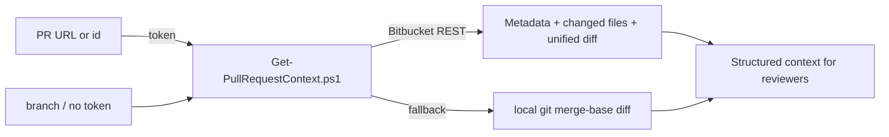

# Bitbucket Pull Request Context

Gather everything a reviewer needs about a pull request on your Bitbucket Server instance
(base URL from `$env:BITBUCKET_BASE_URL`, project key from the PR URL or `-Project`).
A pull request always comes **from a branch** and is tied to **a Jira ticket** — this skill extracts both.

## How a PR Review Works Here
There is **no native Bitbucket Server integration** in VS Code, so this skill fetches the context itself. The
best path is to **paste the pull request link** — with a token, the script reads the metadata, the changed
files AND the unified diff straight from the Bitbucket Data Center REST API. No checkout required.

1. **REST (preferred — "give it a link").** From a PR URL the script parses project/repo/id and calls:
   - `/rest/api/1.0/.../pull-requests/{id}` → title, description, branches, author, reviewers
   - `/rest/api/1.0/.../pull-requests/{id}/changes` → changed files
   - `/rest/api/1.0/.../pull-requests/{id}.diff` → the unified diff
   Requires a Personal Access Token (`$env:BITBUCKET_PAT`) or domain SSO (`-UseDefaultCredentials`).
2. **Local git fallback.** If REST is unavailable (no token / offline), the script diffs the source branch
   against the target in a local checkout (`-RepoPath`) using the merge-base — the "diff available by git"
   workflow. Works with no credentials.

## Procedure
1. Pick the input — any one of:
   - **URL mode (recommended):** the full PR link, e.g.
     `https://bitbucket.example.com/projects/PROJ/repos/my-repo/pull-requests/42/overview`.
   - **PR id mode:** the pull request id + repo slug.
   - **Branch mode:** the source branch (and target, default `develop`) against a local checkout.
2. For REST modes, make sure a token is set: `$env:BITBUCKET_PAT = '<pat>'` (or use `-UseDefaultCredentials`).
   For branch/fallback mode, ensure the checkout is fetched: `git fetch origin`.
3. Run the context script:
   - URL mode: `pwsh ./scripts/Get-PullRequestContext.ps1 -Url https://bitbucket.example.com/projects/PROJ/repos/my-repo/pull-requests/42/overview`
   - PR id mode: `pwsh ./scripts/Get-PullRequestContext.ps1 -PullRequestId 42 -Repo my-repo`
   - Branch mode: `pwsh ./scripts/Get-PullRequestContext.ps1 -SourceBranch feature/PROJ-123 -TargetBranch develop -RepoPath C:\path\to\checkout`
4. Read the script output. It prints five labelled sections:
   - `===== PR METADATA =====` (JSON: title, description, branches, author, reviewers, `headCommit`,
     `jiraKeys`, `source`)
   - `===== PREVIOUS REVIEWS =====` — previous review comments posted by this system, or `none`. This is
     what decides **first review vs. follow-up (round 2+)**.
   - `===== CHANGED FILES =====` (status + path)
   - `===== DIFFSTAT =====`
   - `===== UNIFIED DIFF =====`
5. Pass the **diff**, **changed files**, **description**, and **`jiraKeys`** to the reviewer sub-agents.
6. If `PREVIOUS REVIEWS` is non-empty, this is a **follow-up review** — switch to the `review-followup` skill
   and use the previous findings as the agenda instead of starting over.

## Notes
- `source` in the metadata tells you where the diff came from: `bitbucket-rest` or `local-git`.
- The local diff uses the merge-base (`git diff base...source`), matching what Bitbucket shows in the PR.
- `jiraKeys` are extracted by regex (`[A-Z][A-Z0-9]+-\d+`) from the title, description and branch name.
- Use `-NoRestDiff` to force the local-git diff (e.g. to review uncommitted work) even when a token is set.
- Previous reviews are read from the PR's `/activities` (comments). Only comments carrying the
  `<!-- ai-autopilot: ... -->` marker or a `# PR Review` heading count. `-PreviousReviewLimit` (default 2)
  caps how many rounds come back; `-NoPreviousReviews` skips the lookup entirely.
- `headCommit` is the commit this review round saw. The next round compares against it to build the
  incremental diff. In branch/local mode it is `git rev-parse` of the source branch.
- Previous-review detection is **REST-only** — branch/local mode has no PR comments to read, so a follow-up
  there needs the earlier findings pasted into the prompt.
- Never hardcode or echo tokens. Provide them via environment variables only.
- Human reviewer comments are **not** in this skill's output — it keeps only this system's own previous
  reviews. To read what the reviewers said, use the `bitbucket-pr-threads` skill.
- Endpoints and response shapes: [references/api_examples.md](./references/api_examples.md)
- Script: [Get-PullRequestContext.ps1](./scripts/Get-PullRequestContext.ps1)
